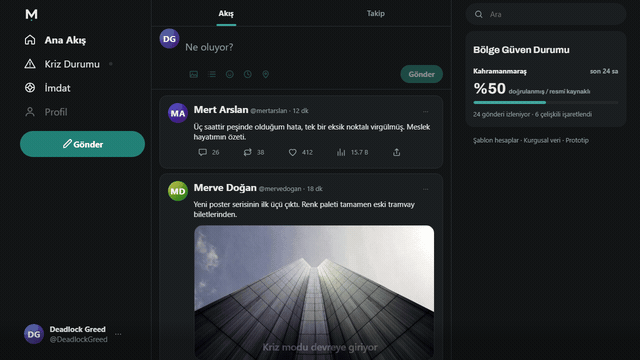
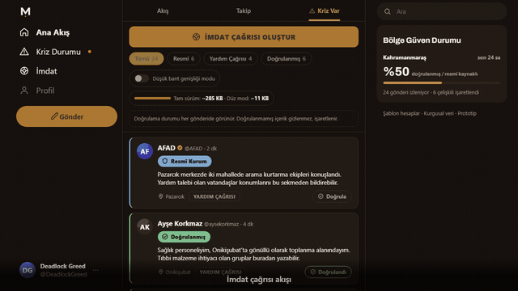
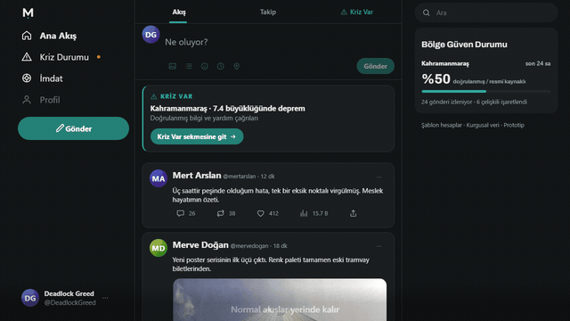

# MİHENK

**Bir sosyal akışın, kriz anında doğrulanmış bilgiye öncelik verecek şekilde
kendi kendini yeniden şekillendirdiği bir arayüz.** TEKNOFEST 2026 NSosyal
İnovasyon Yarışması için geliştirilen, tamamen yerel çalışan bir UI/UX
prototipi — backend yok, gerçek kullanıcı yok, çalışma anında sıfır ağ isteği.

<p>
  
  
</p>
<p>
  
  
</p>

## Neden var

Chuai ve arkadaşlarının (2024, *Nature Communications*) bulgusu: bir gönderi
viral etkisinin yarısını **5,75–6,25 saatte** yaratıyor; Community Notes'un
ortalama not ekleme gecikmesi **61,4 saat**. Yaklaşık 10 kat fark — afet
anında bu fark arama-kurtarmanın altın saatlerinin tamamını yutuyor.

Piyasadaki çözümler üç kalıba giriyor: platformlar bir banner/ayrı sayfa
açıyor ama **ana akış ve sıralama algoritması aynı kalıyor** (Meta Safety
Check, Google SOS Alerts); bazıları sonradan **etiket/not** ekliyor (X
Community Notes); bazıları **bağımsız bir uygulama** olarak duruyor (Ushahidi,
afetharita.com) — ve afet anında kimse yeni bir uygulama indirmiyor.

MİHENK bu üçünü de yapmıyor: **platformun kendi ana bilgi akışı**, kriz
süresince doğrulanmış kaynaklara öncelik verecek şekilde yeniden yapılanıyor.
Ayrı bir katman değil, ürünün kendisi mod değiştiriyor.

## Öne çıkanlar

- **Kademeli kriz etkinleştirme.** Toast → sabitlenmiş kart (FLIP ile aşağı
  iten posta akışı) → üçüncü sekmenin belirmesi, tek bir anda değil, sahnelenmiş
  üç adımda.
- **Dört doğrulama durumu**, her biri kendi rengi + ikonuyla, metni okumadan
  iki metreden ayırt edilebilir: Doğrulanmış, Resmî Kurum, Doğrulanmamış,
  Çelişkili.
- **Beyan esaslı, cezalandırmayan model.** Kriz akışına ne gireceğine kullanıcı
  karar verir; ana akışta krizle ilgili bir şey paylaşılırsa yönlendirme
  önerilir, asla engellenmez.
- **İki palet, tek WCAG 2.2 AA denetimi.** `tools/contrast.mjs`, gerçek token
  değerlerini okuyup 27 çift üzerinde ölçüyor — "iyi görünüyor" değil, sayı.
- **Kare kare deterministik demo kayıtları.** `tools/capture.mjs`, sayfanın
  saatini gerçek zamandan değil sanal saatten ilerletiyor; aynı senaryo her
  çalıştırmada birebir aynı kareleri üretiyor (bkz. yukarıdaki GIF'ler).
- **Sıfır ağ isteği, JavaScript kapalıyken de çalışır.** `dist/mihenk.html`
  tek dosyada her şeyi taşıyor; `index.html`'in `<noscript>` bölümü JS
  olmadan da kriz durumunu okunabilir tutuyor.

## Çalıştırma

Node.js 20 veya daha yeni bir sürüm önerilir.

```bash
npm install
npm start
```

Ardından [http://127.0.0.1:8321](http://127.0.0.1:8321) adresini açın.
Geliştirme sunucusu yalnızca yerel makineye bağlanır.

| Rota | İçerik |
|---|---|
| `/` | Akış |
| `/takip` | Takip |
| `/kriz` | Kriz modu açık olarak doğrudan kriz akışı |
| `?demo=1` | Senaryolu prototip kontrol paneli |

`dist/mihenk.html` dosyası da doğrudan çift tıkla açılabilir — CSS, JavaScript
ve yerel görseller tek dosyaya gömülü, hiçbir isteğe ihtiyaç duymaz.

## Komutlar

```bash
npm run bundle        # noscript içeriğini ve iki tek-dosya çıktısını üretir
npm run check:syntax  # kaynak JavaScript sözdizimini denetler
npm run contrast      # iki paletteki WCAG renk çiftlerini denetler
npm run verify        # gerçek Chromium ile temel akışları doğrular
npm run check         # yukarıdaki üretim ve doğrulama adımlarını birlikte çalıştırır

npm run capture -- --only=imdat --size=1280x720   # tek bir senaryonun klibini üretir
```

Klip üretimi isteğe bağlıdır ve ffmpeg gerektirir. Üretilen `clips/` ve geçici
`.frames/` klasörleri Git dışında tutulur; seçilmiş nihai klipler
`assets/demos/` altında tutulur (bkz. `assets/demos/README.md`).

## Yapı

```text
assets/demos/           README'deki seçilmiş GIF'ler ve nasıl üretildikleri
assets/fonts/           self-host edilmiş başlık fontu
assets/img/             kaynak gönderi görselleri ve lisans notları
data/seed.js            kurgusal hesaplar, gönderiler, avatar/görsel şablonları
scripts/app.js          kabuk, durum, rota, arama, modal, sekmeler, navigasyon
scripts/feed.js         normal akış, paylaşım alanı ve etkileşimler
scripts/crisis.js       kriz akışı, filtreler, paylaşım yönlendirmesi
scripts/imdat.js        yardım çağrısı akışı
scripts/demo.js         deterministik demo senaryoları
styles/tokens.css       renk paleti, tipografi, tüm tasarım token'ları
styles/                 yerleşim, akış, kriz ve düz-mod stilleri
tools/serve.mjs         yerel geliştirme sunucusu
tools/bundle.mjs        tek-dosya paketleyici
tools/gen-static.mjs    JavaScript kapalı belge üreticisi
tools/verify.mjs        tarayıcı doğrulaması
tools/contrast.mjs      kontrast denetimi
tools/capture.mjs       deterministik klip üretimi
dist/                   Git'e dahil tek-dosya dağıtım çıktıları
```

Tarayıcıdaki yükleme sırası önemli: `seed.js` → `app.js` → diğer modüller.
Modüller ortak `window.MIHENK` alanını paylaşır; framework, bundler veya build
adımı yok — düşük bant genişliği modunun HTML'e düz metin olarak geri
düşebilmesi bunu gerektiriyor.

## Tasarım yönü

Görsel kimlik bilinçli bir tercih: X (Twitter) referansıyla başladı — ilk
hedef etkileşim kalitesini kanıtlamaktı — sonra kendi kimliğine ("Taş &
Sinyal": soğuk taş grisi zemin, İznik turkuazı vurgu; kriz modunda sıcak
amber-terrakotaya kayan aynı aile) geçti. Rozetler ve durum göstergeleri her
zaman **solid dolgu**, saydam/tint yüzey kullanılmıyor; gönderiler X'in
uçtan uca çizgiyle ayrılan listesi yerine aralıklı, sınırlı kartlar.

## İçerik ve lisanslar

Tüm hesaplar kurgusal şablon hesaplardır — gerçek kişi, gerçek telefon
numarası veya açık adres yok. `AFAD`, `Valilik`, `Kızılay` ve `Meteoroloji`
temsilî hesaplardır; bu kurumlarla bağlantı, onay veya gerçek zamanlı bilgi
iddiası taşımazlar. Avatarlar kodla üretilen deterministik SVG şablonlardır;
gönderi fotoğrafları `assets/img/` altında yerel tutulan, kaynağı ve lisansı
`assets/img/README.md`'de kayıtlı gerçek fotoğraflardır.

## Kapsam

Bu depo bir ön-uç prototipidir: kimlik doğrulama, kalıcı veri, gerçek zamanlı
kriz doğrulaması veya acil yardım iletimi içermiyor — kapsamı bilinçli olarak
arayüz ve etkileşim tasarımıyla sınırlı; üretim sistemi olarak kullanılmak
üzere tasarlanmadı.
