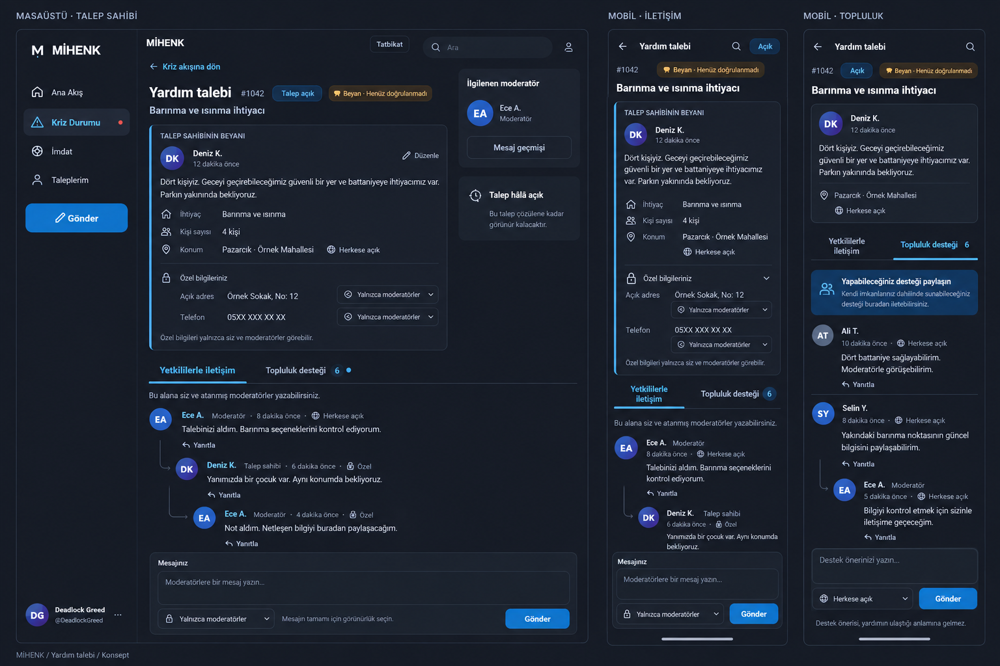

# MİHENK Help Request Detail: UI/UX and Implementation Plan

**Status:** implemented on branch `feature/request-thread-page` (uncommitted) and verified on 18 September 2026. See section 19.

**Date:** 18 September 2026.

**Inspected baseline:** `main`, commit `3c5868052a7b7f1f3e1c92fa1028ba91b3284fc6`.

Sections 1–18 are the original handoff plan and describe the `main` baseline. Section 19
records what was implemented and what was actually verified.

## 1. Approved visual reference and amendments



[Open the full-resolution concept](references/help-request-concept-v1.png).

This is an AI-generated concept, not an implemented application screenshot. People,
messages, and contact details are fictional. Reuse the real application's components,
icons, fonts, and tokens when implementing it.

The user approved this direction with two explicit changes:

1. **Hide the left navigation when the request opens**, reclaiming the space.
2. **Collapse large information sections by default**, keeping the discussion prominent.

These amendments override the image. Do not reproduce its persistent left sidebar,
oversized expanded statement, redundant message-history button, or permanent right-side
information cards. Use the image for palette, typography, hierarchy, statement treatment,
tabs, and forum-style reply relationships.

All explanatory documentation is English. Quoted Turkish strings are intended UI copy.

## 2. Product outcome

A help request opens as a dedicated, full-page thread inside MİHENK. The requester's
statement appears above two conversation tabs:

- **Coordination:** the requester communicates with pre-authorized volunteer moderators.
- **Community support:** other people provide information and offers of support.

The requester focuses on coordination without reading a busy public conversation.
Moderators can follow both channels. Outsiders may read explicitly public coordination
updates, but never private messages or private contact details.

The interaction borrows the clarity of a forum thread, not Hacker News's visual design.
Use carefully spaced, left-aligned messages and identifiable reply relationships, rather
than alternating messenger bubbles or a dense comment wall.

## 3. Scope

Implement the following as one coherent request-detail feature:

- Full-page routing, direct links, reload, back/forward, and return-to-feed state.
- Responsive desktop, tablet, and mobile layouts.
- Collapsed statement details, private fields, and management controls.
- Two discussion tabs, threaded replies, per-channel drafts, and sending states.
- Request creation/editing with public description and independently private contact fields.
- Whole-message public/private choice in coordination.
- Server-enforced visibility, authorization, and channel-specific fetching.
- Distinct request closure, community pause, and public-access restriction.
- Compatibility with shared mode and the local single-user demonstration.

Do not include keyword interception, report-count promotion into the crisis feed,
removal of the `Tümü` filter, identity/AI checks on `Ben de gördüm`, a new verification
system, actual AFAD integration, or automated dispatch in this change.

Preserve the ordinary social feed, report dialog, and non-request discussion behavior.
An ordinary post with the `yardim` tag is not necessarily a structured request. Use
canonical `kind === 'request'` in shared mode and existing structured `need` data locally.

Do not add attachments, rich-text editing, reactions, direct messages, typing indicators,
or presence indicators just to complete this page.

## 4. Decisions and terminology

### Confirmed by the user

- Feed cards remain; opening a request displays its full-page detail.
- The page title is always `Yardım talebi`.
- The original statement stays above the discussion.
- Moderators are volunteers designated in advance, not automatically AFAD personnel.
- The requester chooses who can see address and phone information.
- Only the requester and authorized moderators write in coordination.
- Outsiders can read coordination messages explicitly marked public.
- The public community discussion is separate; moderators read and respond there.
- The requester's default focus is coordination.
- Message visibility applies to the entire message at composition time.
- Moderators can close public access and close the request.
- Large information sections start collapsed and the left navigation disappears.

### Recommended implementation defaults

- New address and phone fields default to private.
- New coordination messages default to private; community messages are public.
- The requester can intentionally visit and participate in community, but gets no
  community-driven coordination unread badges or notification previews.
- All explicitly authorized request moderators within the request's existing scope
  can coordinate it in v1. A per-request assignment/claim workflow is not required.
- Do not label a moderator as assigned or responding unless there is evidence for that state.
- Moderators can manage access/lifecycle, but cannot rewrite the requester's statement.
- Published message body and visibility are immutable in v1. Field privacy remains editable.
- Closure does not erase history or automatically mean that help arrived.
- Verification, coordination activity, and delivery of aid remain separate concepts.

These defaults are design decisions for implementation, not descriptions of existing features.

## 5. Layout and information hierarchy

### Desktop

Center a readable thread page in the reclaimed viewport. Target a maximum page width
around 1040–1120 px. Keep message text lines generally below 80 characters rather than
stretching prose across the full monitor.

```text
┌──────────────────────────────────────────────────────────────────┐
│ Back to feed          Yardım talebi              State / actions  │
├──────────────────────────────────────────────────────────────────┤
│ Barınma ve ısınma · 4 kişi · Pazarcık                             │
│ Deniz K.                         Separate verification label      │
│ ▸ Talep sahibinin beyanı         Last update / expand affordance   │
├──────────────────────────────────────────────────────────────────┤
│ Yetkililerle iletişim           Topluluk desteği                   │
├──────────────────────────────────────────────────────────────────┤
│ Moderator / time / visibility                                     │
│ Message body                                                     │
│   └─ Requester / time / visibility                                │
│      Reply body                                                  │
│                                                                  │
│ Conversation / load previous replies                              │
├──────────────────────────────────────────────────────────────────┤
│ Reply target, if selected                            Cancel reply │
│ Message input                                                    │
│ Visibility selector                                      Gönder  │
└──────────────────────────────────────────────────────────────────┘
```

- Hide global left navigation, right sidebar, global composer, floating action button,
  and duplicated feed tabs while detail is open. Remove their grid columns too.
- Use one page scroll container, not a separately scrolling thread inside another page.
- Limit sticky content to the compact request header and discussion tabs.
- The statement remains above the discussion in document order but scrolls normally.
- Put management actions in a compact overflow/disclosure control.
- Do not replace the removed sidebar with another permanently expanded information rail.

### Mobile and tablet

- One column with 12–16 px horizontal padding; no global sidebar or bottom navigation.
- Back arrow, short title, and compact state/actions fit in the header.
- Need, person count, public location, and request state stay concise and visible.
- The statement summary takes one or two lines. Avoid shrinking the expanded desktop card.
- Allow the two tab labels to wrap to two lines. No horizontal tab scrolling at 320 px.
- Reply indentation is limited to one visual level on narrow screens.
- Keep the composer at the end of the thread. An optional compact `Mesaj yaz` action
  can jump to it when off-screen; never cover the discussion with a tall pinned textarea.
- When the keyboard opens, the textarea, visibility control, and send action remain reachable.
  Account for dynamic viewport height and safe-area padding.
- Do not autofocus on page entry or force the mobile keyboard open before reading.
- Tablet keeps the same single-thread hierarchy with wider gutters.

### Default visible versus collapsed

| Always available near the top | Collapsed by default |
| --- | --- |
| Back, page title, request state | Full original statement |
| Need, person count, public location | Detailed request fields |
| Author and separate verification status | Address/phone and their privacy settings |
| Two discussion tabs | Moderator/lifecycle controls |

Errors, closure notices, and critical state changes must not be hidden in a disclosure.

## 6. Statement, contact fields, and editing

Use a semantic disclosure, preferably `<details>` and `<summary>`, for
`Talep sahibinin beyanı`. Keep the short need summary outside it.

When expanded, show author, creation/update times, public statement, needs, person count,
public location, and any contact fields the viewer is allowed to receive. Owner-only
`Düzenle` leads to the edit flow. Private information and visibility controls sit in a
separate nested disclosure, not as permanent rows consuming the conversation viewport.

The public statement preserves line breaks and is explicitly described as public text
when composing/editing. Address and phone are separate fields, each with:

- `Herkese açık`
- `Yalnızca moderatörler`

The requester always sees their own values. Explain briefly that moderator-only
information is visible to the requester and eligible moderators.

Keep a public district/neighborhood/landmark separate from the detailed address. Never
derive the public location by copying the private address string. Preserve location
uncertainty and useful landmarks; do not turn uncertainty into an empty location or
invent precise coordinates.

Avoid arbitrary text-selection redaction in v1. Dedicated fields make the privacy boundary
understandable. Do not add an AI privacy detector as a dependency.

Privacy edits require an explicit save with a version check. Partial edits preserve all
unmentioned fields. Public-to-private changes remove the field from future public views;
they cannot revoke what someone already saw or saved.

## 7. The two conversation tabs

### Coordination: `Yetkililerle iletişim`

- Default for the requester and eligible moderators.
- Only those actors may write; outsiders get a read-only public-updates view.
- Public viewers receive no private messages, parent previews, author lists, placeholders,
  hidden-message counts, or pagination offsets calculated from hidden messages.
- Each visible message has author, actual role, timestamp, visibility, and an allowed reply action.
- Use lock + `Özel` for private messages and globe + `Herkese açık` for public ones.
- New messages default to private. Switching from community must not silently carry over
  public visibility. A restored draft keeps its explicit selection.
- A moderator writes a fresh public update rather than automatically exposing private context.

### Community: `Topluluk desteği`

- A feed-card `Destek öner` action opens this tab.
- A neutral request link otherwise starts in coordination; outsiders see public updates there.
- Public participants with write permission contribute information or support offers.
- Moderators may reply and use the information to prepare coordination updates.
- Requesters can deliberately visit, read, and participate here, but community messages
  do not produce their coordination badges, notification previews, or interruptions.
- The composer states `Herkese açık` as a fixed label, not a selectable private option.
- Show the quiet helper: `Destek önerisi, yardımın ulaştığı anlamına gelmez.`
- Preserve the existing distinction between replies and active support offers.
  An ordinary comment must not accidentally create another offer.

## 8. Threaded replies and composition

Use real `parentId` relationships and forum-style left alignment. Limit visual indentation
to one level and add reply-context labels for deeper nesting. Do not render an endlessly
narrowing tree or a separate rounded card around every small message.

Rules enforced on both client and server:

1. Parent exists, is readable, and belongs to the same request and channel.
2. A reply to a private message must be private. Disable public selection and explain why.
3. A public child cannot reveal a private parent through quoted text, names, or links.
4. No automatic cross-channel forwarding. Moderators compose fresh summaries.
5. Parent lookup uses the same access rules as thread lookup.
6. A removed message must not persist as a cached quoted preview.
7. Pagination preserves visible context: fetch a readable missing parent or offer an
   authorized `Yanıt verilen mesajı aç` action.

Use chronological root ordering and group directly related replies where available.
On loading earlier replies, preserve the visible message as the scroll anchor.

### Composer behavior

- One composer for the active tab, with a cancelable reply-target strip.
- Visible input label, textarea, visibility control, send state, and inline errors.
- Enter inserts a newline. Optional Ctrl/Cmd+Enter sends; the button remains primary.
- Drafts are independent per account, run, request, and channel. Include text, visibility,
  parent ID, and any pending command ID/payload.
- Switching tabs neither sends nor discards text. Do not clear the other channel after sending.
- Prefer session-scoped persistence for sensitive drafts. Do not put private text in URLs,
  analytics, generic error strings, or broad feed caches.
- Retry an uncertain send with the identical command ID and payload.
- Freeze a pending command's payload until success or definite rejection. Editing after
  a definite rejection creates a new command ID.
- A successful receipt remains successful if refreshing the view then fails.
- Close/pause/revocation during composition preserves text safely and explains why sending stopped.

## 9. Permissions and request lifecycle

The server decides access. The frontend renders explicit per-request capabilities.
Being an organization account, having a badge, or volunteering publicly grants no private access.

| Action | Requester | Eligible request moderator | Public participant | Observer |
| --- | --- | --- | --- | --- |
| Read public request/history | Yes | Yes | Yes | Yes |
| Read private fields/messages | Own request | Within authorized scope | No | No |
| Write coordination | Yes, while open | Yes, while open | No | No |
| Write community | Deliberately | Yes | Yes | No |
| Edit statement/field privacy | Yes | No | No | No |
| Manage public participation/access | No | Yes | No | No |
| Close/reopen request | Yes | Yes | No | No |

Every action also respects run status, account bans, existing region/post scope, and
current visibility. Ownership does not override a write ban. Reading does not imply mutation rights.

### Three separate controls

| State | Meaning | Behavior |
| --- | --- | --- |
| `status: open / closed` | Request lifecycle | Closing stops new messages in both channels; history remains. |
| `communityOpen: boolean` | Public discussion writing | Pausing preserves history and allows private coordination. |
| `publicAccess: public / restricted` | Outsider access to the request | Restriction hides request/history from outsider feeds, search, reposts, and direct links. |

Moderators can use `Topluluk mesajlarını durdur`, `Talebi herkese kapat`, and
`Talebi kapat` as distinct actions with clear explanations and reverse actions.
Keep them in collapsed management controls, not prominently beside the send button.

Record actor, time, and a short reason. Use `Talep kapalı`; only say `İhtiyaç karşılandı`
when explicitly reported as the closure reason. Reopening does not automatically restore
public access or resume community writing.

Public restriction leaves access for the requester and eligible moderators. It is not
deletion from privileged operator records. Verification status remains independent:
replying, handling a request, or closing it must not automatically mark its content verified.

## 10. Visual system and accessibility

Reuse the current CSS, which takes precedence over older repository design documents:

| Token | Current value | Purpose |
| --- | --- | --- |
| `--c-bg` | `#1b1e27` | Page background |
| `--c-bg-2` | `#212530` | Inputs/statement surfaces |
| `--c-bg-3` | `#2a303d` | Secondary surfaces |
| `--c-border` | `#343b49` | Separators |
| `--c-text` | `#edf1f7` | Primary text |
| `--c-text-2` | `#a6afc0` | Secondary text |
| `--c-accent` | `#6bb9ff` | Selected tab/navigation |
| `--c-accent-fill` | `#2176bc` | Primary action |

Keep Archivo in its established brand/display role and the current system body font.
Target 15–16 px body text, 22–25 px line height, and 44 px minimum touch targets.

- Use a restrained blue leading rule for the statement; it does not mean verified.
- Use existing verification semantics, with words/icons rather than color alone.
- Provide visible focus rings, semantic headings, tab roles/controls, and arrow-key tab navigation.
- Native disclosures expose expanded state without extra custom keyboard behavior.
- Preserve expansion while refreshing the same page; new request visits start collapsed.
- Updates must not steal focus, collapse sections, reset drafts, or interrupt text selection.
- Escape user content, preserve line breaks safely, and wrap long unbroken strings.
- Support 200% zoom, narrow phones, reduced motion, and current plain/low-bandwidth mode.
- Do not load new remote fonts or decorative media for this page.
- Keep actionable errors inline; a disappearing toast alone is insufficient.

## 11. Proposed data/API contract

These are proposed interfaces, not code that already exists. Reuse existing author,
version, timestamp, needs, people, and location fields rather than duplicating the model.

```ts
type Visibility = 'public' | 'private';
type Channel = 'coordination' | 'community';

interface RequestExtensions {
  details: string;                  // Public statement, max 2,000 characters
  phone: string;                    // Optional, max 40 characters
  privacy: {
    address: Visibility;            // Applies to detailed location.text
    phone: Visibility;
  };
  publicLocationText: string;       // Optional public landmark, max 240
  communityOpen: boolean;
  publicAccess: 'public' | 'restricted';
  closedBy?: string;
  closedAt?: string;
  closeReason?: 'resolved' | 'withdrawn' | 'duplicate' | 'other';
}

interface MessageExtensions {
  channel: Channel;
  visibility: Visibility;
  parentId: string | null;
}

interface RequestCapabilities {
  canReadPrivate: boolean;
  canEditStatement: boolean;
  canWriteCoordination: boolean;
  canWriteCommunity: boolean;
  canManagePublicAccess: boolean;
  canClose: boolean;
  canReopen: boolean;
}

interface ThreadQuery {
  thread: string;
  channel: Channel;
  messageLimit?: number;
  messageOffset?: number;
}
```

Unknown person count remains `null`. Location certainty remains independent of visibility.

### Commands

- Extend request create/update with statement, phone, privacy, and public location fields.
- Extend reply create with channel, visibility, and parent ID.
- Keep support offers public in community and preserve withdrawal behavior.
- Prefer a narrow `request.manage` command for public access/community settings rather
  than granting moderators unrestricted owner-style `request.update`.
- Extend close/reopen authorization to designated request moderators.
- Validate every new field/enum/parent and closed/restricted state at execution time.
- Retain request version checks and command receipts/idempotency.
- Do not make every chat message invalidate the request's field-edit version unnecessarily.
- Partial updates preserve unmentioned fields and never copy private address into public text.

### Capability grant trap in the current code

`server/access.mjs` currently derives participant operations with `names.filter(...)`,
excluding only the existing moderation operations. Adding a new operation could therefore
grant it to all participants unless the exclusion/allowlist logic is updated.

Use explicit request-moderation capabilities/profile. Assign them through the existing
operator mechanism to designated volunteers. Preserve historical removal-only moderation
profiles and experiments instead of silently widening their powers. A role label must
not bypass an explicit operation allowlist or region restriction.

### Privacy projection order

1. Resolve the canonical request behind any repost.
2. Check normal read permission, scope, and public-access restriction.
3. Project request fields for this viewer; omit inaccessible properties entirely.
4. Select the requested channel.
5. Filter unreadable messages before counting and pagination.
6. Project safe message fields and authorized parent context.
7. Return explicit capabilities and viewer-specific metadata.

Do not spread raw storage objects into API output. Audit feed items, thread views, own
requests, related posts, author history, search, reposts, update previews, counts, cursors,
and `seen` target IDs. Private text must not influence public search matches.

Load community message bodies only when the requester opens that tab. Hiding messages
already downloaded does not meet the bandwidth intent. Any moderator unread count is
computed independently and must not become requester coordination urgency.

Current SSE events carry invalidation, not message bodies. Preserve this boundary.
Make invalidation/refresh channel-aware so unrelated private/community traffic does not
reload the requester's entire thread. Do not add private counts to event metadata.

On access revocation, session change, or public restriction, clear privileged caches and
remove unauthorized DOM content promptly. Do not wait for a full page reload. This prevents
future exposure; it cannot recall values delivered while access was legitimately allowed.

## 12. Existing code map

| File | Observed role and required integration |
| --- | --- |
| `scripts/app.js` | Shell/routing/startup/modals. Hide and restore chrome, preserve feed scroll/focus, integrate request route. |
| `scripts/request-thread.js` | `M.openThread` currently shows a modal with combined replies/offers. Delegate structured requests to the new page; preserve ordinary posts/reports. |
| `scripts/request-page.js` (new) | Page lifecycle, disclosures, tabs, thread rendering, composer, request controls. |
| `styles/request-page.css` (new) | Scoped responsive detail styles and plain-mode treatment. |
| `scripts/transport.js` | API cache/hydration and offline adapter. Add channel queries, safe projections, partial updates, and local behavior parity. |
| `scripts/shared.js` | SSE/feed refresh/own updates. Separate channels and preserve active detail state. |
| `scripts/imdat.js` | Creation/edit wizard. Add statement/contact privacy without losing existing drafts and conflict handling. |
| `scripts/crisis.js` | Request cards/owner actions. Route to detail and avoid sensitive feed summaries. |
| `server/access.mjs` | Explicit operations, region/post scope, request capabilities. |
| `server/world.mjs` | Validate/mutate new fields, channels, parents, lifecycle/access; preserve receipts and deltas. |
| `server/views.mjs` | Filter request/message fields, search, counts, updates, and pagination before responding. |
| `server/http.mjs` | Shared routes, SSE, and static asset allowlist. Add new assets and preserve the protected operator boundary. |
| `server/store.mjs` | JSON state in SQLite, records/events/receipts. Review normalization/export compatibility; no storage rewrite required by this plan. |
| `lab/operations.mjs` | Extend operation schemas and optional arguments; preserve legacy required fields. |
| `lab/participant.mjs` | Update target mapping, command preparation, and channel-aware observations without privacy bypasses. |
| `lab/tool-surface.mjs`, `lab/gateway.mjs` | Check operation/query adapters against new contracts. |
| `scripts/operator.js` | Expose explicit request-moderator access configuration if a new profile is introduced. |
| `index.html`, `participant.html` | Load new assets in both app entrypoints. |
| `tools/bundle.mjs` | Add new modules to explicit CSS/JS lists, then regenerate standalone output. |
| `package.json` | Include new modules in the existing explicit syntax-check command. |

### Integration hazards already identified

- `publicPost` currently exposes full location and global reply counts.
- `projectView` currently combines all messages; its `updates` projection includes text.
- `requestFields` currently accepts only needs, people, and location.
- Request mutations are owner-only; moderation has no request coordination flow yet.
- `publicOffline` spreads local objects; it is not a privacy boundary.
- `offlineSend` assumes request updates include `payload.location` and `payload.need`.
  A partial privacy patch would otherwise erase data or throw.
- `transport.getView({thread: ...})` hydrates global feed state. Detail requests must
  not unexpectedly replace the feed or overwrite newer responses.
- Modal edit/report actions over the new page must preserve inert/focus/Escape behavior.
- The shared server uses an explicit asset allowlist; adding an HTML script tag alone is insufficient.
- Shared startup consumes `#join`, and `initShared` recognizes `#post`. Preserve both.
- Repository README descriptions predate some server functionality; follow active code.

## 13. Routing and frontend state

Recommended route: `/kriz?request=<id>&channel=coordination`.
For standalone HTML, preserve its filename and tab parameter:
`mihenk.html?t=kriz&request=<id>&channel=coordination`.
This avoids inventing a nested route the shared server does not serve.

- Push history once for feed-to-request entry; replace state for channel changes.
- Preserve return route, filters, scroll, and initiating control identity in history state.
- Back restores the feed and focus; forward reopens the request.
- A directly opened request uses a safe feed fallback instead of blindly leaving the site with `history.back()`.
- Resolve request links after session/transport initialization. Preserve parameters through startup route replacement.
- Adapt old `#post` links by inspecting whether the target is a structured request.
- Remove request/channel parameters when leaving detail for ordinary app navigation.
- Loading/unavailable states occupy the full page; no half-open modal remains underneath.
- Keep private content out of URLs and history state.
- Dispose page-specific listeners/subscriptions on exit.

Suggested page state:

```ts
interface RequestPageState {
  requestId: string;
  channel: 'coordination' | 'community';
  expanded: { statement: boolean; privateFields: boolean; management: boolean };
  scrollByChannel: Record<string, number>;
  draftsByChannel: Record<string, {
    text: string;
    visibility: 'public' | 'private';
    parentId: string | null;
    pendingCommand?: object;
  }>;
  requestGeneration: number; // Discard late responses after navigation/tab switches
}
```

Do not persist client-side capabilities as authorization. Refresh them from the server.

## 14. Edge cases and feedback

| Situation | Behavior |
| --- | --- |
| No moderator reply | Say `Henüz moderatör yanıtı yok.` Do not imply assignment or guaranteed response. |
| Outsider has no public coordination updates | Say `Henüz herkese açık bir güncelleme yok.` Do not hint at private messages. |
| Community empty | Invite a concrete information/support contribution. |
| New messages while reading older content | Show a quiet `Yeni mesajlar` action; preserve position/draft. |
| User at the conversation end | Append safely without disrupting selection or active input. |
| Older page loaded | Preserve a visible-message scroll anchor. |
| Send timeout | Preserve draft/pending command and reuse its ID on retry. |
| Request closes during typing | Reject send, preserve text, show the new state. |
| Community pauses | Preserve community draft; authorized coordination stays available. |
| Parent becomes unreadable | Remove reply target, preserve unsent text safely, require review before sending. |
| Edit version conflict | Show current values without discarding the unsaved draft. |
| Moderator access revoked | Remove private content/cache and refresh capabilities. |
| Public access restricted | Remove outsider detail content; preserve owner/moderator access. |
| Field becomes private | Invalidate stale public feed/detail/search representations. |
| Multiple devices/tabs | Server versions/receipts decide outcomes, not local assumptions. |
| Long content, zoom, narrow screen | Wrap without horizontal page scrolling. |
| JavaScript disabled | Preserve existing static fallback; do not promise interactive messaging. |

## 15. Compatibility and prototype boundaries

- New requests receive explicit privacy/channel defaults.
- Legacy addresses were collected with a public notice. Preserve their existing visibility
  until the owner changes it; do not silently invent a historical permission decision.
- A phone added later defaults to private if no phone privacy setting exists.
- Legacy replies/offers remain public community messages. Do not retroactively relabel them private.
- Missing `communityOpen` means true; missing `publicAccess` means public.
- Missing parent ID means a root message.
- Old partial request updates preserve all new fields they omit.
- New coordination clients send explicit channel and visibility. Do not silently change
  legacy automated public-reply clients into private coordination writers.
- Preserve replay/export behavior or version it explicitly. Normalization must not alter
  historical initial states so that exact replay comparison fails.

The local single-user mode demonstrates UI behavior, not multi-user privacy. Actual
authorization is proved in shared mode. Use fictional seed data; do not copy real contact
information into demos. Existing privileged operator exports may contain complete state;
participant endpoints must never expose those exports or a read-all shortcut.

## 16. Implementation sequence

Implement production behavior directly. Do not begin with failing tests.

### Step 1: Authorization and safe views

Define request capabilities, fix operation allowlists, normalize legacy records, and build
reusable viewer-safe field/message projections. Cover feed, detail, updates, related content,
search, counts, and reposts together. Preserve unrelated moderation profiles.

### Step 2: Commands and shared transport

Add fields, channels, parents, and management mutations with server validation. Preserve
idempotency/versioning. Update operation schemas, target maps, adapters, query handling,
and asset allowlists. Fetch only the active channel's permitted messages.

### Step 3: Page shell and navigation

Add the page module/styles and entrypoint wiring. Delegate existing structured request
actions. Hide global chrome and reclaim its columns. Implement compact summary,
collapsed details, and direct-link/back/forward behavior before layering in interactions.

### Step 4: Discussion interactions

Implement tab-specific views, empty/loading states, replies, drafts, visibility, retry,
pagination, refresh, and conflict/closure handling. Keep community noise out of the
requester's coordination view and avoid downloading its message bodies until requested.

### Step 5: Creation, editing, management, and offline parity

Connect statement/contact fields to the wizard and owner edits. Add distinct moderator
controls. Preserve unknown-location/people semantics. Make the local adapter handle
partial updates and new conversation data safely; do not claim it enforces multi-user access.

### Step 6: Responsive refinement and delivery

Review real collapsed and expanded screens at 1440×900, 768×1024, 390×844, and 320 px width.
Check keyboard-open behavior, long content, and increased text size. Run existing relevant
checks and a narrow privacy/access exercise. Regenerate standalone outputs after completion.
Record what was implemented and actually verified. Do not commit or push without explicit user instruction.

## 17. Proportional verification

Use existing checks first: `npm run check:syntax`, `npm run contrast`, and relevant existing
browser verification. `npm run bundle` regenerates standalone deliverables. Inspect a
check before running it; some selectors may encode the old modal. Report unrelated failures
without expanding scope into infrastructure repair.

Do not add tests for routine UI work. If a new automated check is necessary, restrict it
to the exceptionally critical private-data authorization boundary, write it only after
implementation, and use the smallest existing setup. No new test framework or elaborate fixtures.
One isolated local request with owner, authorized moderator, participant, and observer
roles is enough for the targeted access exercise.

### UI acceptance

- [ ] Left/right global chrome disappears without empty layout gutters.
- [ ] Back restores feed state, scroll, and focus; direct link/reload/forward work.
- [ ] Initial mobile viewport exposes the tabs and useful conversation content.
- [ ] Statement, private fields, and management start collapsed.
- [ ] Refresh preserves expansion, scroll, selected text, and drafts.
- [ ] Both tabs work; actual parent replies stay readable on mobile.
- [ ] Visibility selectors describe the actual server audience.
- [ ] Essential actions remain usable at 320 px, 200% zoom, and with the keyboard open.
- [ ] Ordinary feed/post/report flows remain functional.

### Access and state acceptance

- [ ] Public responses contain no private fields/messages/parent previews/hidden counts.
- [ ] Search, notifications, reposts, related posts, and cursors do not reveal private content.
- [ ] Crafted outsider coordination writes are rejected server-side.
- [ ] Unauthorized/out-of-scope moderators cannot read or manage the request.
- [ ] Cross-request/channel parents and public replies to private parents are rejected.
- [ ] Observer/banned users do not gain write permission through ownership or role labels.
- [ ] Management operations are available only to explicitly designated moderators.
- [ ] Closure, community pause, and public restriction remain independent.
- [ ] Community bodies are not fetched for the requester until that tab is opened.
- [ ] Access changes remove privileged cache/DOM state without requiring a reload.
- [ ] Uncertain retries produce one message rather than duplicates.
- [ ] Both entrypoints and standalone bundles include the new assets.

## 18. Suggested Turkish UI copy

| Purpose | Copy |
| --- | --- |
| Title | Yardım talebi |
| Back | Akışa dön |
| Statement disclosure | Talep sahibinin beyanı |
| Private information disclosure | Özel bilgiler ve görünürlük |
| Coordination tab | Yetkililerle iletişim |
| Community tab | Topluluk desteği |
| Private choice | Yalnızca moderatörler |
| Public choice | Herkese açık |
| Short private message label | Özel |
| Privacy helper | Bu bilgileri yalnızca siz ve yetkili moderatörler görebilir. |
| Public coordination helper | Herkese açık güncellemeler. Destek için Topluluk desteği sekmesini kullanın. |
| Private-parent helper | Özel bir mesaja verdiğiniz yanıt da özel kalır. |
| Coordination placeholder | Moderatörlere bir mesaj yazın… |
| Community placeholder | Paylaşabileceğiniz bilgiyi veya desteği yazın… |
| Reply / cancel | Yanıtla / Yanıtı iptal et |
| Previous / new messages | Önceki mesajları göster / Yeni mesajlar |
| Send / retry | Gönder / Gönderimi yeniden dene |
| Closed request | Talep kapalı. Yeni mesaj yazılamaz. |
| Paused community | Topluluk mesajları moderatör tarafından durduruldu. |
| Unavailable request | Bu talep şu anda görüntülenemiyor. |
| Unknown people | Kişi sayısı henüz bilinmiyor |
| Uncertain location | Konum kesin değil |
| Offer helper | Destek önerisi, yardımın ulaştığı anlamına gelmez. |

The feature is ready for review when the amended concept is recognizable in actual
collapsed mobile/desktop views and the access checks are evidenced. Visual similarity
alone is not proof of private communication.

## 19. Implementation record (18 September 2026)

Implemented on branch `feature/request-thread-page`. Nothing has been committed.

### Files

- New: `scripts/request-page.js`, `styles/request-page.css`, `server/request-policy.mjs`,
  `lab/request-access-check.mjs`.
- Changed: `server/access.mjs`, `server/world.mjs`, `server/views.mjs`, `server/http.mjs`,
  `server/store.mjs`, `scripts/app.js`, `scripts/transport.js`, `scripts/shared.js`,
  `scripts/imdat.js`, `scripts/request-thread.js`, `scripts/operator.js`,
  `lab/operations.mjs`, `lab/participant.mjs`, `index.html`, `participant.html`,
  `tools/bundle.mjs`, `package.json`. `dist/` regenerated.

### What was implemented, by plan step

- **Step 1.** Explicit `request_moderator` role (`request_manage`, `reply_create`,
  `request_close`, `request_reopen`, reads). The legacy `moderator` profile is unchanged,
  and `request_manage` is excluded from the participant allowlist. `requestCapabilities`
  and `requestProjection` live in `server/request-policy.mjs`; `canReadMessage`,
  `privateRequestAccess` and the public-access restriction live in `server/access.mjs`.
  Views project request fields per viewer, filter thread messages by channel and
  readability before pagination, count only readable replies, keep community traffic out of
  the requester's `updates`, and return parent context only when readable.
- **Step 2.** `details`, `phone`, `publicLocationText` and `privacy` with validation and
  partial updates; `channel`, `visibility` and `parentId` on replies and offers with the
  parent rules from section 8; `request.manage` for `communityOpen` and `publicAccess`
  with a recorded actor, time and reason; close reasons; moderator close and reopen.
  Operation schemas, target maps and the asset allowlist are updated. SSE `changed`
  events carry `{posts, channels, accessChanged}` computed per stream and never message
  bodies; `store.seenFor` reads the stored session row so revoked posts still invalidate.
- **Step 3.** Full-page `#request-page` inside `main`; global chrome hidden through
  `data-request-page`; route `/kriz?request=<id>&channel=<channel>`; `pushState` on entry
  and `replaceState` on channel change; back restores feed scroll and the initiating
  control's focus; direct link, reload and forward work; `#join` consumption now preserves
  the query string; old `#post` links are delegated when the target is a request.
- **Step 4.** Two tabs with arrow-key navigation; per-channel drafts in `sessionStorage`
  including the pending command; reply-target strip; private-parent rule enforced in the
  composer; earlier-messages pagination with a scroll anchor; `Yeni mesajlar` refresh from
  channel-aware SSE; read-only states for closure, community pause and restriction;
  unavailable and removed states; refresh on tab visibility.
- **Step 5.** The wizard collects the public statement, public landmark, and private
  address and phone with visibility selectors; edits preload them; owner and moderator
  management disclosure with three distinct actions and a close reason; the local adapter
  stores requests, messages and receipts in `sessionStorage`, applies partial updates,
  enforces closed and coordination rules for the single local account, and loads before
  the first feed render.

### Verification evidence

- `npm run check:syntax` passes. `npm run contrast` reports ALL PASS. `npm run bundle`
  regenerated `dist/mihenk.html` and `dist/artifact.html`.
- `node lab/request-access-check.mjs`: 45 of 45 pass. Roles: owner, request moderator,
  region-scoped request moderator, participant, observer. Covered: private fields and
  messages, parent rules, cross-channel parents, search, SSE silence for private
  messages, community pause, public restriction, close and reopen independence,
  idempotent retry, legacy records.
- Playwright screenshots in local and shared modes at 1440×900, 768×1024, 390×844 and
  320×700: nav, side, fab and bottom bar hidden; no horizontal scroll at 320 px; statement,
  private fields and management collapsed by default; expansion preserved across a tab
  switch; one level of reply indentation; the outsider page contains no private strings;
  the refresh button appears after a public moderator update. No console errors.
- `npm run verify`: 23 of 24 pass. The failing check `bayt karşılaştırması ölçülmüş`
  reads `innerText` of the byte chip inside the closed `Görünüm seçenekleri` details,
  which is empty in the current Chromium although the chip HTML is correct. The involved
  files (`scripts/crisis.js`, `tools/verify.mjs`, styles) are unchanged from `main`, and
  the same probe fails on an untouched `main` checkout, so this is pre-existing.

### Not done and known limits

- No per-request assignment: every `request_moderator` within scope can coordinate any
  request, as recommended for v1.
- Published message bodies and visibility are immutable; field privacy is edited through
  the wizard, not inline.
- Local mode demonstrates layout only; every local message is authored by the single
  local account.
- `tools/verify.mjs` does not exercise the request page; the access script is the only
  new automated check.
- The old modal thread remains for ordinary posts and reports.

## 20. Follow-up: single entry point and card redesign (18 September 2026)

Feedback after a live demo: the old reply modal still opened for posts tagged `yardim`,
which competed with the new page, and the card offered no clear way in.

### Changes

- **Help calls join the request page.** Any post tagged `yardim` (a "help call") opens
  the request page and follows the same channel rules. This supersedes the section 3
  sentence that kept ordinary `yardim` posts in the old modal. Server side, `helpPost`
  in `server/request-policy.mjs` decides; coordination writes on a help call are limited
  to its author and request moderators, and other posts still have no coordination channel.
  Help calls have no close, reopen, management or field privacy; their page title is
  `Yardım çağrısı` and the header shows no state chip.
- **Card redesign (`scripts/crisis.js`, `scripts/request-thread.js`,
  `styles/request-page.css`).** Help cards show `Talep açık` / `Talep kapalı` in the
  header row, need chips, the people count and an uncertain-location note, then one
  primary `Talebi aç` (`Çağrıyı aç` for help calls) button with `Destek öner`, readable
  message counts (`N güncelleme · N topluluk mesajı`) and the report action. Clicking
  the card text also opens the page unless text is selected. The owner-only
  `İhtiyacım karşılandı` and `Talebi güncelle` card buttons were removed; those actions
  live on the page.
- **Counts.** `messageCounts` (readable coordination and community messages, withdrawn
  offers excluded) is projected per viewer for help posts; the local adapter keeps the
  same counters and restores them for seed posts from saved messages.
- **Requester notification.** A coordination change while the requester reads the
  community tab now marks the coordination tab; community changes still mark only
  moderators.
- **Composer fixes found in the demo.** After a successful send the textarea, visibility
  and message-kind selectors reset; the closed-request header shows the closure reason.

### Verification

- `npm run check:syntax` passes; `node lab/request-access-check.mjs` passes 52 of 52,
  including the new help-call checks (author-only private coordination, outsider read and
  write rejection, moderator read, ordinary posts rejecting the coordination channel).
- Playwright card captures at 1440 and 390 px in local and shared modes: state chip,
  need chips, counts and entry button render; no removed owner buttons; body click and
  `Talebi aç` open the page; a help call opens with the `Yardım çağrısı` title and a
  read-only coordination composer for non-authors; the outsider card contains no private
  address. No console errors.

## 21. Follow-up: announcements, offers, filters (18 September 2026)

Requested during the same review session and committed as `e0867a7`.

- **Institutional announcements take no comments.** Posts whose verification is
  `official` (non-request) reject `reply.create` on the server
  (`Kurumsal duyurulara yorum yazılamaz.`), expose no `reply.create` action, show
  `Kurumsal duyuru · Yorumlar kapalı` instead of a thread button on the crisis card,
  hide the reply action on ordinary feed cards, and open the old modal read-only with the
  same note. They are not help calls even when tagged `yardim`.
- **Offer withdrawal.** The request page asks `Destek önerisi geri çekilsin mi?` in a
  modal before sending `offer.withdraw`; withdrawn offers are removed from thread and
  update projections and from the local adapter's counters, so no placeholder remains.
- **Filters.** `Tümü` is gone; the chips are `Resmî · Yardım · Doğrulanmış ·
  Doğrulanmamış · Taleplerim`, none pressed by default, each a toggle (pressing the
  active chip returns to the full list). `M.setCrisisFilter(name, instant)` is the single
  entry point used by the wizard, the simulation and the `#my-requests` shortcut. The
  `Yardım` filter lists only structured requests (`need`), not information posts.
  `dogrulanmamis` exists server side in the filter list, counts and operation schema.
  Chips wrap instead of scrolling; mobile chips are 36 px high.
- **Bilgi paylaş** matches the red request button in green (`#1f7f57`, white text,
  4.9:1) and keeps its plain-mode outline.

Verification: `npm run check:syntax` passes; `node lab/request-access-check.mjs` passes
56 of 56 (adds withdrawn-offer removal, official-announcement rejection and the
unverified filter); crisis head captures at 1440, 390 and 320 px show one chip row on
desktop and two on phones with no horizontal scroll; the toggle returns to
`Bölgeden güncellemeler`; the official card carries the closed-comments note.

## 22. Merged follow-ups (18 September 2026, later)

- **Card-style crisis head** (`04edfbd`, merged in `55a4713`): `.crisis-intro` and
  `.crisis-actions` sit in one `.crisis-card` styled as a sibling of the pinned crisis
  card (border, 1 px accent edge, 16 px radius); the red and green buttons keep their size
  and stack on phones; plain mode falls back to a flat black block.
- **Code review fixes** (`1f96d38`, from `docs/reviews/2026-09-18-code-review.md`):
  `request.close`/`request.reopen` are state transitions (a second close cannot rewrite
  the recorded reason), an empty `request.manage` is rejected instead of bumping the
  version, a pending command keeps its frozen parent so an uncertain retry reuses the
  same command ID, a refresh during a failed send rebuilds the composer, only a selection
  inside the card blocks the body click, help-call moderators get the community dot,
  parent authors join the `seen` list, `accessChanged` fires only for the viewer's own
  policy, and the local adapter guards partial updates, missing offers and private
  community messages. Stale `localStorage` help drafts are removed.
- **Wizard review** (`b22ec9a`): the review step shows `Herkese açık konum`,
  `Adres tarifi` and `Telefon` with their visibility; a public landmark alone counts as a
  known location on the server and in the wizard.
- **Chat cap** (`92e6bae`): 1000 characters per message with a visible counter from 800
  and the server message `Mesaj en fazla 1000 karakter olabilir.`
- **Explainer strips** (`3b1d4bd`, merged in `5d2ce1a`): `scripts/section-notes.js` and
  `styles/section-notes.css` render a tinted strip with an `Anladım` button above every
  section (feed tabs, each crisis filter, both request channels); dismissal is remembered
  per key in `localStorage`. `.rp-channel-note` was replaced by the strip.

Verification on the merged tree: `npm run check:syntax` passes; `npm run contrast` ALL
PASS; `node lab/request-access-check.mjs` 63 of 63; `npm run verify` 23 of 24 with only the
pre-existing byte-chip failure; the visual tour (feed, crisis tab, filters, wizard, old
modal, request page open/closed, shared moderator and owner views) at 1440 and 390 px shows
no console errors.

## 23. UX and copy review fixes (18 September 2026)

Review: `docs/reviews/2026-09-18-ux-copy-review.md` (63 findings). Applied on branch
`fix/request-ux-copy`; finding ids below refer to that file.

- **Safety and privacy.** The three management actions now confirm in a modal before
  sending, matching offer withdrawal (F20). Labels return to the approved
  `Topluluk mesajlarını durdur` / `Talebi herkese kapat` / `Talebi kapat` and the heading
  `Kamusal erişim` becomes `Herkese açık erişim` (F21, F22). The close reason no longer
  defaults to `Diğer`: `Kapatma nedenini seçin` is required (F23). The private-fields
  padlock and its promise now follow the actual per-field visibility, and a public field
  gets its own sentence (F16). The wizard review lists `İlçe`,
  `Herkese açık yer tarifi`, `Ayrıntılı adres` and `Telefon` separately with their
  audience, instead of printing the private address as `Konum` (F46); the public-location
  hint stops asking for a street (F45); a public landmark now counts as known location
  (F47).
- **Hierarchy.** The collapsed statement carries a two-line preview (F13); a request with
  no statement says `Beyan eklenmedi` instead of repeating the need summary (F14); the
  requester gets a visible `İhtiyacım karşılandı` and `Talep bilgilerini düzenle` row
  (F24, F17); closure, community pause and public restriction render as notices above the
  tabs and the header chip stops abbreviating the reason (F42); the management disclosure
  collapses after a successful action (F25). Help cards show the requester's own statement
  (4-line clamp) instead of the generated need sentence, counts are named after the tabs,
  and non-owners get a `Topluluk desteği` entry button (F1, F2, F4). `Destek öner` now
  lands on the composer (F5).
- **Copy.** Kind-aware `talep` / `çağrı` strings (F27); community empty state
  `Henüz topluluk mesajı yok` with viewer-specific bodies, coordination empty states split
  between requester and moderator, and no invitation to a channel the viewer cannot write
  in (F28–F32); the refresh button is labelled by cause instead of always claiming
  `Yeni mesajlar` (F41); loading no longer reuses the error screen (F40); one retry label
  (F36); the wizard is formal throughout, its close control is `Formu kapat`, and its
  success screen distinguishes create from edit (F44, F49–F51); `Tatbikat` replaces
  `Yerel prototip` (F55).
- **Accessibility.** Clicking a tab keeps focus on it (F57); a refresh restores focus and
  caret (F58); the unread dot is `role="img"` (F59); 44 px targets for the mobile back
  control and message actions (F60); the accent focus ring replaces the UA ring on the
  title (F10); the community channel drops the per-message `Herkese açık` badge (F34); a
  private parent shows static text instead of a disabled dropdown (F37).

Not applied, by decision: F52 (the statement needs its own wizard step, which changes the
step count `scripts/demo.js` drives), F9 (relative timestamps), F26 (a role-dependent
coordination tab label), F8 (the `#id` chip) and F62 (heading levels on the unavailable
screen). F7 is partly addressed: a help call still has no `h2`, but the verification chip
now joins the fact row, so there is no orphan title row. Every other finding in the review
is applied.

Verification: `npm run check:syntax` passes, `npm run contrast` reports ALL PASS,
`node lab/request-access-check.mjs` passes 63 of 63, `npm run bundle` regenerated `dist/`.
Playwright captures in local and shared modes at 1440, 390 and 320 px: statement preview,
owner action row, closure notice, management labels, both confirmation modals, the blocked
close without a reason, focus on the clicked tab, no per-message audience badge in
community, 44 px back control, no horizontal scroll, no private strings in the outsider
page, no console errors.

## 24. Final merged state (18 September 2026, end of session)

Branch `feature/request-thread-page` after merging `fix/request-ux-copy` (section 23) and
regenerating bundles. Checks on this tree: `npm run check:syntax` passes; `npm run contrast`
ALL PASS; `node lab/request-access-check.mjs` 63 of 63; `npm run verify` 23 of 24 with only
the pre-existing byte-chip failure; the visual tour at 1440 and 390 px (feed, crisis tab,
filters, wizard, old modal, request page with the new close and reopen confirmations,
shared moderator and owner views) and the card checks (withdraw confirmation, help call,
body click) report no console errors. Agent worktrees for the head restyle, the explainer
strips and the code review were removed after merging; `mihenk-ux-fixes` can be removed
once the branch is no longer needed.

Open design question raised by the owner after the merge: the thin colored left edge on
the crisis head card, the pinned card, the statement card and the explainer strips reads
as generic; alternatives are being explored in a separate design artifact before any
further styling change.

## 25. AI verification for information posts (TODO, UI placeholder only)

Decided by the product owner on 18 September 2026 for the presentation; only the
user-facing placeholder exists (`scripts/ai-verification.js`, `styles/ai-verification.css`).
No model, no server contract, no automatic labelling runs yet.

**Sources.** The model is given a fixed list of recognised public institutions and
disaster-relief organisations as its research sources. It searches those sources and
decides whether an information post is true, false or unclear.

**Labels.** `Doğrulandı` (green), `Yalan` (red), `Muallak` (grey). Open design point:
keep the AI verdict as a separate field and chip (`aiVerdict`) so it never overwrites the
moderator or official verification state; the moderator verdict stays authoritative.

**Priority queue** (the one-hour threshold is a first guess):
1. Information posts published more than one hour ago that no moderator has handled,
   oldest first.
2. If none, posts that moderators have already handled, oldest to newest (re-check).
3. If none, every information post in plain order, oldest to newest.

**Placeholder behaviour today.** On the moderator tab of an information post the block
`Yapay zeka doğrulaması · Prototip` shows one of three states derived from the same rules:
`Moderatör bekleniyor` (younger than one hour, no moderator message), `Yapay zeka sırasında`
(older than one hour, no moderator message) and `Moderatör değerlendirdi` (a moderator
message exists), plus the three-label legend. Presentation note: the block is a promise of
the mechanism, not a result.

**Still to design.** Model prompt and provenance (which source supported the verdict),
rate and cost limits, what happens when sources disagree, how a verdict is surfaced on the
card and in the feed filters, and the audit record of each automatic label.
